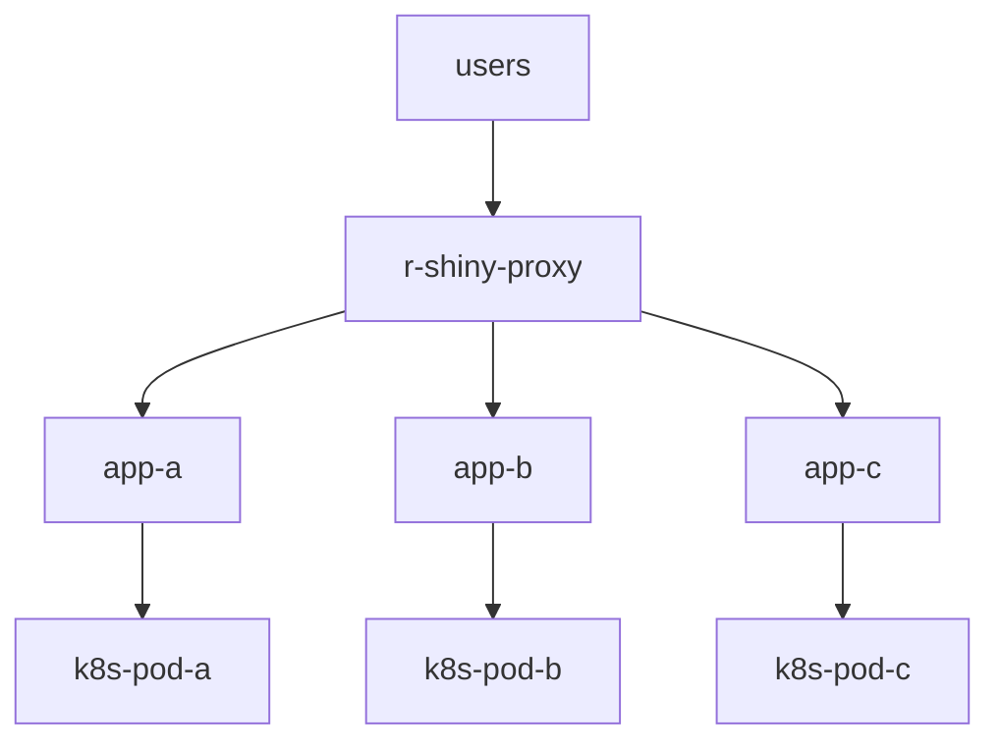

# R Shiny Proxy on AKS 
https://github.com/lola-pola/r-shiny-proxy/actions/workflows/r-shiny-proxy.yaml/badge.svg

<details>
  <summary>Click to see the - diagram</summary>
    
    

</details>
    
## Demo 


<details>
  <summary>Click to see the - build</summary>
    
### build component


```
export registry_name='tevaprivatedemo.azurecr.io'
echo ${registry_name}
```

```
docker build -t ${registry_name}/kube-proxy-sidecar:1 kube-proxy-sidecar/
docker push ${registry_name}/kube-proxy-sidecar:1
```

```
docker build -t ${registry_name}/shinyproxy-application:1 shinyproxy-application/
docker push ${registry_name}/shinyproxy-application:1
```


### craete app proxy configuration 
you need to validate what need to change in this file 

```

r-shiny-proxy/shinyproxy-application/application.yml
```

```
example : 

proxy:
  port: 8080
  authentication: simple
  admin-groups: admins
  users:
  - name: Elhay
    password: Elhay@123
    groups: admins
  - name: Gili
    password: Gili@123
    groups: admins
  - name: Noam
    password: Noam@123
  - name: Guest
    password: Guest@123
  container-backend: kubernetes
  kubernetes:
    internal-networking: true
    url: http://localhost:8001
    namespace: shiny
    image-pull-policy: Always
  specs:
  - id: Demo
    display-name: Demo by region
    description: Demo which shows telephone by region
    container-image: tevaprivatedemo.azurecr.io/r-shiny-app:latest << image for app >>
    # access-groups: [scientists, mathematicians]
  - id: Gili
    display-name: Gili by region
    description: Gili which shows telephone by region
    container-image: tevaprivatedemo.azurecr.io/r-shiny-app:latest << image for app >>
    # access-groups: [scientists, mathematicians]
logging:
  file:
    shinyproxy.log


```
</details>

<details>
  <summary>Click to see the - install on AKS  </summary>
  
### install on AKS  

```
helm upgrade -i r-shiny-proxy --create-namespace -n r-shiny-proxy  r-shiny-proxy
```

validate 

```
kubectl get ingress -n r-shiny-proxy 
```

```
kubectl get pods  -n r-shiny-proxy 
```


start to the url and start enjoy :) 
</details>


</details>

<details>
  <summary>Click to see the - puting all togahter </summary>
  
### puting all togahter L:)

```
export registry_name='tevaprivatedemo.azurecr.io'
echo ${registry_name}
docker build -t ${registry_name}/kube-proxy-sidecar:1 kube-proxy-sidecar/
docker push ${registry_name}/kube-proxy-sidecar:1
docker build -t ${registry_name}/shinyproxy-app
lication:1 shinyproxy-application/
docker push ${registry_name}/shinyproxy-application:1

helm upgrade -i r-shiny-proxy --create-namespace -n r-shiny-proxy  r-shiny-proxy

kubectl get pods  -n r-shiny-proxy 

kubectl get ingress -n r-shiny-proxy 

kubectl get pods  -n r-shiny-proxy  -w 

```
</details>
